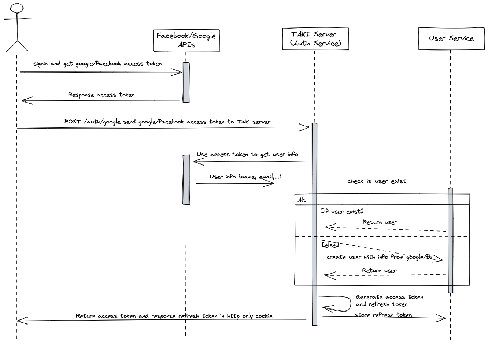

# Taki REST API

[](https://railway.app/template/NeiLty?referralCode=ySCnWl)

## Installation

```sh
git clone https://github.com/thanhvule0310/taki-server
cd taki-server
pnpm install
```

Your configuration variables should be placed in a `.env` file that you create. See the.env.example file for more details.

## Run

```sh
pnpm run start:dev
```

### Required

-   NodeJS
-   MongoDB

## Features

-   RESTful API
-   NestJS
-   Swagger
-   JWT
-   MongoDB
-   NodeMailer
-   Google Auth
-   Facebook Auth
-   Imgur storage

### Third Party Auth Flow


